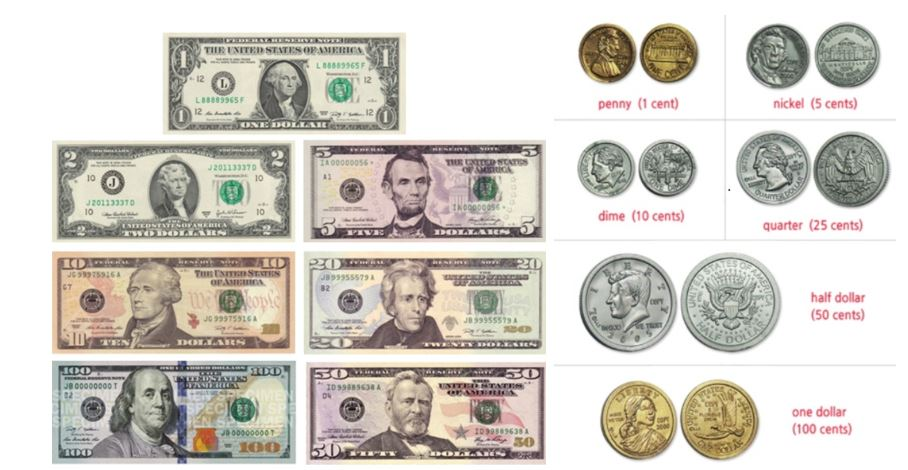
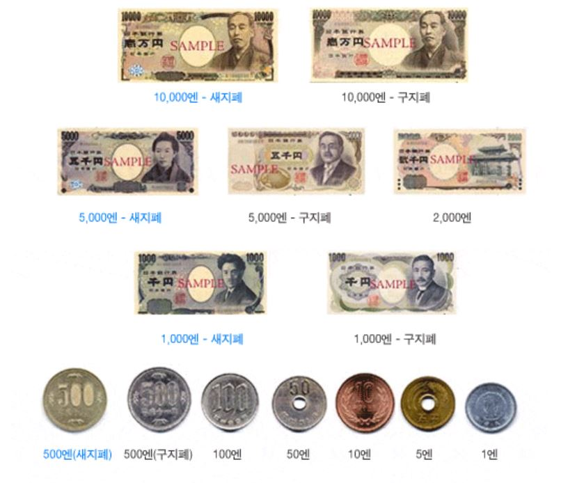

# AI-expense-Manager-of-Trip
---
This is a repository for ML modules of AI-expense-Manger-of-Trip(MT).

# Dataset
---
1. USD 
 
 
* link : [https://github.com/AI-expense-Manager-of-Trip/ML/dataset/usd](https://github.com/AI-expense-Manager-of-Trip/ML/dataset/usd) 

2. JPY 
 
 
* link : [https://github.com/AI-expense-Manager-of-Trip/ML/dataset/jpy](https://github.com/AI-expense-Manager-of-Trip/ML/dataset/jpy) 

3. CNY 
 
 
* link : [https://github.com/AI-expense-Manager-of-Trip/ML/dataset/cny](https://github.com/AI-expense-Manager-of-Trip/ML/dataset/cny) 

4. KRW 
 
 
* link : [https://github.com/AI-expense-Manager-of-Trip/ML/dataset/krw](https://github.com/AI-expense-Manager-of-Trip/ML/dataset/krw) 

5. EUR 
 
* link : [https://github.com/AI-expense-Manager-of-Trip/ML/dataset/eur](https://github.com/AI-expense-Manager-of-Trip/ML/dataset/eur) 
